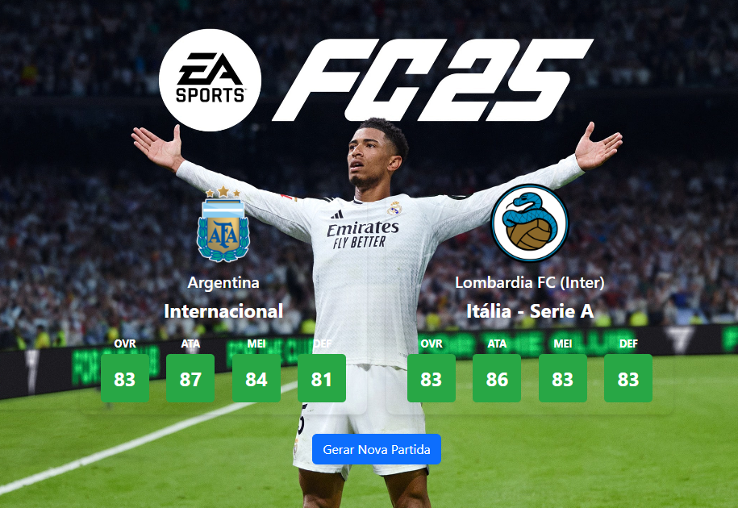

# Gerador de Partidas 1x1 no EA FC

**[➡️ Acesse a aplicação clicando aqui!](https://psouza0.github.io/gerador-partidas-ea-fc/)**

## Descrição
Esta aplicação foi projetada para facilitar a criação de partidas 1x1 no jogo **EA FC**, com foco em manter o equilíbrio competitivo e a variedade de clubes e seleções. O sistema segue regras específicas para a seleção de times, garantindo uma experiência justa e diversificada para os jogadores.

## Regras de Seleção de Times
1.  **Melhores Clubes e Seleções**:
    * Apenas times com **overall igual ou superior a 79** são considerados para o sorteio.

2.  **Variedade Garantida**:
    * Um mesmo confronto **não se repetirá durante 5 gerações** de partidas, garantindo maior diversidade.

3.  **Equilíbrio Competitivo**:
    * A diferença de **overall** entre os times sorteados é limitada a no máximo **2 pontos**.

## Benefícios
- **Partidas Equilibradas**: As regras asseguram que nenhum jogador tenha uma vantagem desproporcional.
- **Diversidade nos Confrontos**: A repetição de partidas é evitada, incentivando novas estratégias a cada jogo.
- **Simplicidade**: A geração é instantânea, com apenas um clique.

## Tecnologias Utilizadas
- **HTML5**: Estrutura da página.
- **CSS3**: Estilização e layout.
- **JavaScript**: Lógica de geração de partidas e manipulação da página.
- **Bootstrap**: Framework para agilizar o design responsivo.

## Como Utilizar
1.  Acesse o link da aplicação no GitHub Pages.
2.  Clique no botão "Gerar Nova Partida".
3.  Aproveite partidas equilibradas e divertidas!

## Contato
Caso tenha dúvidas ou sugestões, entre em contato:
- **Email**: `paulogeraldols@gmail.com`
- **GitHub**: [psouza0](https://github.com/psouza0)